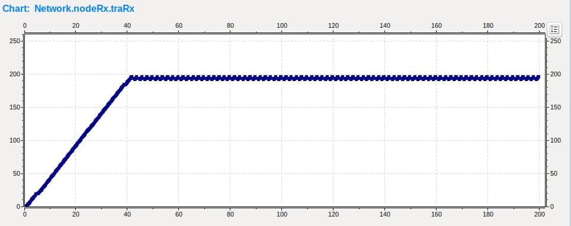

# Laboratorio 3: Capa de Transporte

## Analisis

Analisis sobre el impacto de la tasa de transferencia de datos
y memoria de buffers en el trafico de red.

### Modelo de Colas

Consta de tres módulos simples:
1. Generator (crea y transmite paquetes con intervalos dados por una
distribución exponencial de media configurable).
2. Queue (es capaz de atenderlos bajo una misma distribución con un máximo
de 100 paquetes por vez).
3. Sink (toma métricas de la demora de entrega de los paquetes)

## Nuevos módulos agregados

Para el estudio y realizacion de este laboratorio se generaron dos modulos
adicionales, denominados `NodeTx` y `NodeRX`, compuestos como sigue:

- NodeTx: Un Simple Generator y un Simple Queue (`QueueTx`).

- NodeRx: Un Simple Queue (`QueueRx`) y un Simple Sink.

Quedando tres colas a estudiar, `QueueTx`, el
original de la Network `Queue` y `QueueRx`.

## `Caso 1`

En este caso los valores seteados de Data Rate y Delay fueron:

- NodeTx (nodeTx.out) a Queue (queue.in): datarate = 1 Mbps y delay = 100 us

- Queue (queue.out) a NodeRx (nodeRx.in): datarate = 1 Mbps y delay = 100 us

- Queue (queue.out) a Sink (sink.in): datarate = 0.5 Mbps

## Analisis previo:

Viendo la configuracion seteada, podemos ver que habrá un cuello de botella
en el módulo NodeRx debido a que su tasa de transferencia de datos es de
0.5Mbps y la entrada es de 1Mbps, lo que generará que se llene el buffer,
y posteriormente pérdida de paquetes.

## Analisis por intervalos de generacion exponencial

### Intervalo de generacion = 0.1

Paquetes generados y almacenados en el buffer de `NodeTx`: 1979

Paquetes recibidos y almacenados en el buffer de `Network`: 1970
Mostrando una pérdida de 9 paquetes que viajaban desde el buffer de `NodeTx`
hacia el buffer de `Network`.

Paquetes recibidos y almacenados en el buffer de `NodeRx`: 1199
Mostrando un pérdida de 771 paquetes que viajaban desde el buffer de
`Network` hasta el buffer de `NodeRx`. Debido a un buffer overflow en
`NodeRx`, como dijimos en el analisis previo.

Paquetes recibidos en `Sink`: 998

#### Grafico general

#### NodeTx queue

Aqui podemos ver que se alcanza el pico de 33 paquetes encolados simultaneamente
a los 82s.

#### Network queue

La cantidad de paquetes encolados se mantiene constante en 1

#### NodeRx queue

En el segundo 42.7 el buffer de NodeRx alcanza su máximo de paquetes almacenables,
lo que implica que empezarán a perderse paquetes.

#### NodeRx delay

Tiempo que demora un paquete en llegar de origen a destino

#### Promedio de Delay

Aproximadamente hay un promedio de 33s de tiempo que tarda un paquete
en llegar desde origen a destino.

### Intervalo de generacion = 0.166

Paquetes generados y almacenados en el buffer de `NodeTx`: 1190

Paquetes recibidos y almacenados en el buffer de `Network`: 1190

Paquetes recibidos y almacenados en el buffer de `NodeRx`: 1190

Paquetes recibidos en `Sink`: 997

#### Grafico general

#### NodeTx queue

Se alcanza un máximo de 7 paquetes encolados simultáneamente
a los 137 segundos.

#### Network queue

La cantidad de paquetes encolados se mantiene constante en 1

#### NodeRx queue

No se llena el buffer de NodeRx

#### NodeRx delay

Tiempo que demora un paquete en llegar de origen a destino

#### Promedio de Delay

Aproximadamente hay un promedio de 16s de tiempo que tarda un paquete
en llegar desde origen a destino.

### Intervalo de generacion = 0.39

Paquetes generados y almacenados en el buffer de `NodeTx`: 508

Paquetes recibidos y almacenados en el buffer de `Network`: 508

Paquetes recibidos y almacenados en el buffer de `NodeRx`: 508

Paquetes recibidos en `Sink`: 508

Encontramos un punto de inflexión (0.39) donde si bajamos de este número
no llegan todos los paquetes generados a `Sink`.

Por otro lado si bajamos de (0.166) empezaremos a perder paquetes dentro
de los buffers de la network, como se muestra con el valor de intervalo
de generacion (0.1).

## `Caso 2`

En este caso los valores seteados de Data Rate y Delay fueron:

- NodeTx (nodeTx.out) a Queue (queue.in): datarate = 1 Mbps y delay = 100 us

- Queue (queue.out) a NodeRx (nodeRx.in): datarate = 0.5 Mbps y delay = 100 us

- Queue (queue.out) a Sink (sink.in): datarate = 1 Mbps

## Analisis previo:

Viendo la configuracion seteada en este caso, podemos ver que habrá un cuello de botella
en el módulo `Queue` debido a que su tasa de transferencia de datos es de
0.5Mbps y la velocidad de entrada a su buffer es de 1Mbps, lo que generará que se llene el buffer, y posteriormente pérdida de paquetes.

## Analisis por intervalos de generacion exponencial

### Intervalo de generacion = 0.1

Paquetes generados y almacenados en el buffer de `NodeTx`: 1979

Paquetes recibidos y almacenados en el buffer de `Network`: 1199

Mostrando una pérdida de 780 paquetes que viajaban desde el buffer de `NodeTx` hacia el buffer de `Network`, debido a un buffer overflow
en Network queue.

Paquetes recibidos y almacenados en el buffer de `NodeRx`: 999

Se pierden 200 paquetes debido al buffer overflow en Network queue.

Paquetes recibidos en `Sink`: 998

### Intervalo de generacion = 0.166

Paquetes generados y almacenados en el buffer de `NodeTx`: 1190

Paquetes recibidos y almacenados en el buffer de `Network`: 1190

Paquetes recibidos y almacenados en el buffer de `NodeRx`: 997

Se pierden 193 paquetes debido al buffer overflow en Network queue

Paquetes recibidos en `Sink`: 997

`1- ¿Qué diferencia observa entre el caso de estudio 1 y 2?`

La diferencia que se observa es la ubicación de los cuellos de botella.

En el caso 1 encontramos un cuello de botella en el módulo `NodeRx`
dónde el buffer interno recibe paquetes mas rápido de lo que es capaz de despacharlos. Nos encontramos con un problema de flujo de datos

En el caso 2 encontramos un cuello de botella en el módulo `Queue` de Network donde el buffer interno recibe paquetes mas rápido de lo que los
puede despachar. Nos encontramos con un problema de congestión.

`2- ¿Cuál es la fuente limitante en cada uno?`

En el caso 1 la fuente limitante es el data rate en el tramo que va del nodeRx.queue al nodeRx.sink.

En el caso 2 la fuente limitante es el data rate en el tramo que va del Network.queue al NodeRx.queue.

---

---

---

---

---

## Diseño

Implementación del sistema de control de flujo y congestión (entre destino y el generador) para evitar la perdidas de paquetes por saturación de buffers. 

## Más módulos nuevos agregados

Para lograr dicha implemetación fueron agregados dos módulos
`transportTx` y `transportRx` a los módulos de la parte de análisis `NodeTx` y `NodeRx` respectivamente.

## `Caso 1`

En este caso los valores seteados de Data Rate y Delay fueron:

- NodeTx (nodeTx.gateio$o) a Queue (queuei.in): datarate = 1 Mbps y delay = 100 us

- Queue (queuei.out) a NodeRx (nodeRx.gateio$i): datarate = 1 Mbps y delay = 100 us

- Queue (traRx.toApp) a Sink (sink.in): datarate = 0.5 Mbps

## Analisis previo:

En este caso de estudio se verifica como el problema de flujo es manejado por el módulo TranRx, ya que este al ver colapsado su buffer de almacenamiento de paquetes, envía un mensaje de alerta al módulo TranTx para que decremente la frecuencia con la que envía paquetes por la conexión y de este modo al estar el buffer de TranRx lleno no tener que descartar paquetes.

## Analisis por intervalos de generacion exponencial

### Intervalo de generacion = 0.1

#### Grafico de todos los datos

#### NodeTx.queue

#### Queuei

#### NodeRx.queue

#### NodeRx delay

## `Caso 2`

En este caso los valores seteados de Data Rate y Delay fueron:

- NodeTx (nodeTx.gateio$o) a Queue (queue.in): datarate = 1 Mbps y delay = 100 us

-  Queue (queuei.out) a NodeRx (nodeRx.gateio$i): datarate = 0.5 Mbps y delay = 100 us

- Queue (traRx.toApp) a Sink (sink.in): datarate = 1 Mbps

## Analisis previo:

En el presente caso de estudio, al contrario que el caso 1, se presenta un problema de congestión en la red el cual es manejado por los nodos internos de la red que componen el camino entre el generador y el receptor por el cual transita el paquete enviado.
En este caso se puede verificar en las graficas el manejo de esta situación por el módulo Queue, el cual al ver colapsado su buffer de almacenamiento de paquetes libera un mensaje a la red indicando esta situación de congestión el cual es pasado hasta el generador para indicarle a este que disminuya la frecuencia de generación de paquetes y de esta forma poder lidiar con el problema de congestión en la red.

## Analisis por intervalos de generacion exponencial

### Intervalo de generacion = 0.1

#### Grafico de todos los datos

#### NodeTx.queue

#### Queuei

#### NodeRx.queue

#### NodeRx delay

`1. ¿Cómo cree que se comporta su algoritmo de control de flujo y congestión? ¿Funciona para el caso de estudio 1 y 2 por igual? ¿Por qué?`

Nuestro algoritmo de control de flujo y congestión funciona de la misma manera para ambos casos porque en ambos la solución implementada fue bajar la cantidad de datos liberados del buffer emisor para evitar la perdida de paquetes en el buffer del receptor (Caso 1, control de flujo) y también en el buffer intermedio (Caso 2, control de congestión).